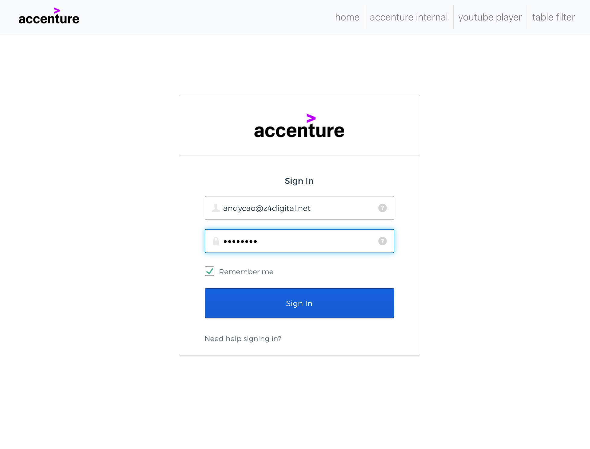
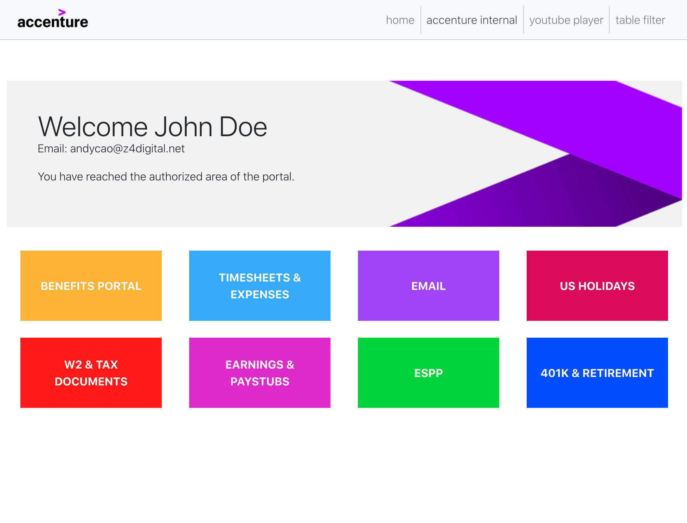
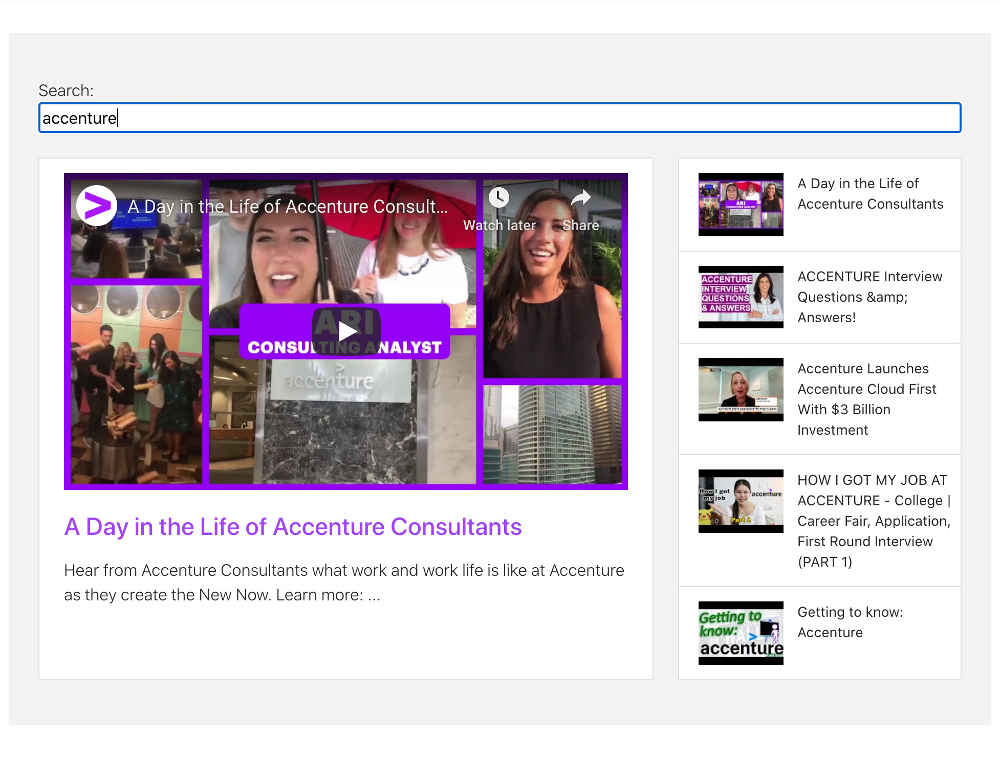
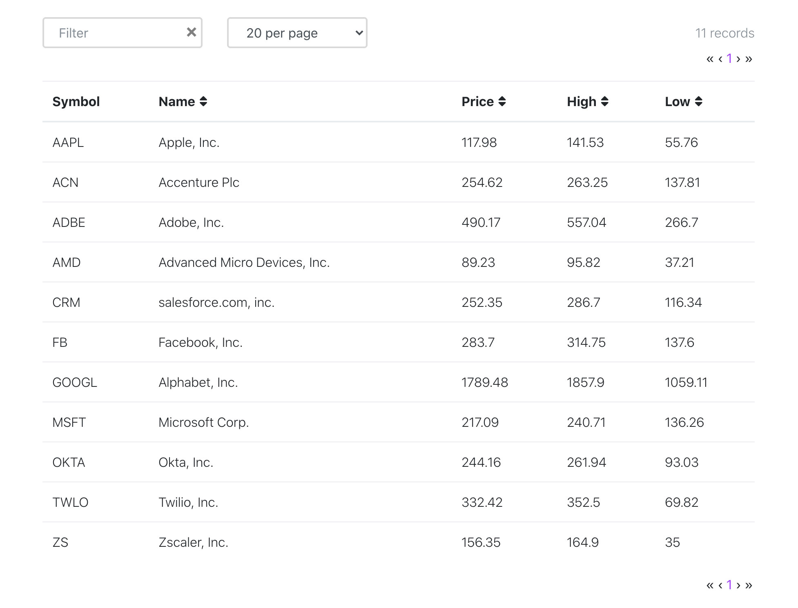
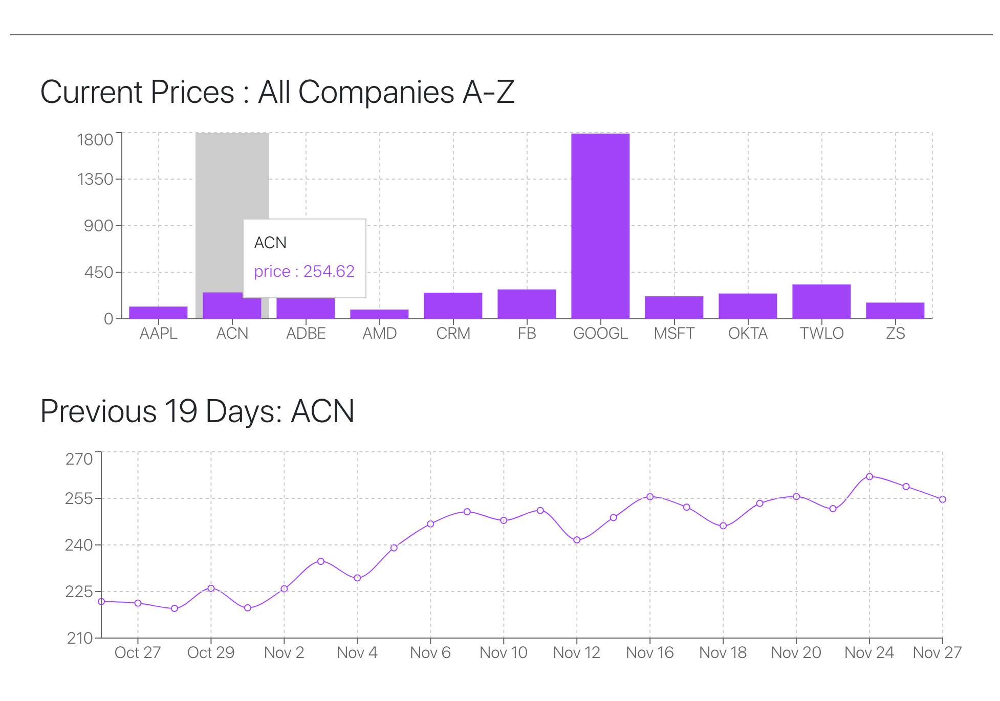

# ReactJS POC

## Table of Contents

* [Description](#description)
* [Installation](#installation)
* [Authentication](#authentication)
* [Screenshots](#screenshots)

## Description

This react app is a proof-of-concept that serves as a personalized content-hub for internal accenture service gateways. It also demonstrates various important and standard features such as Okta oauth login, a youtube video search engine and playlist-supporting player via youtube api v3, a filterable/sortable table template, as well as a data graph/charting system.

## Installation

```
npm install
npm start
```

Runs the app in the development mode.<br>
Open [http://localhost:3000](http://localhost:3000) to view it in the browser.

## Authentication
Username: andycao@z4digital.net<br>
Password: Test123!

## Screenshots

###### Okta Authentication


###### Accenture Internal Gateways


###### Youtube Video Search & Player with Playlist


###### Sortable Table


###### CanvasJS Charting & Graph

